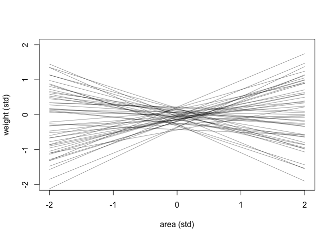
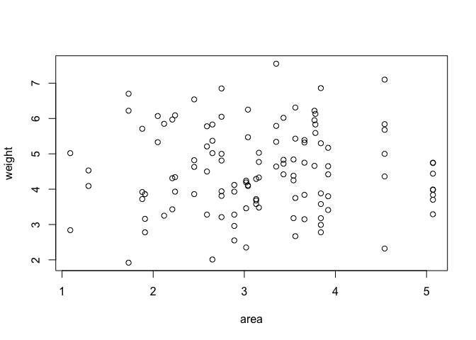
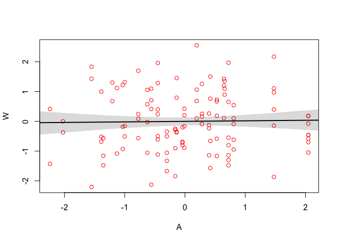
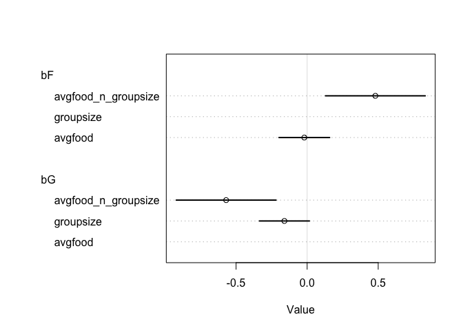

Sam Low

### Question

<a href="https://github.com/rmcelreath/statrethinking_winter2019/blob/master/homework/week03.pdf" class="uri">https://github.com/rmcelreath/statrethinking_winter2019/blob/master/homework/week03.pdf</a>

Use a model to infer the total causal influence of area on weight. Would
increasing the area available to each fox make it heaver? You might want
to standardize the variables. Regardless, use prior predictive
simulation to show that your model’s prior predictions stay within the
possible outcome range

### load the rethinking package

``` r
library(rethinking)
```

    ## Loading required package: rstan

    ## Loading required package: ggplot2

    ## Registered S3 methods overwritten by 'ggplot2':
    ##   method         from 
    ##   [.quosures     rlang
    ##   c.quosures     rlang
    ##   print.quosures rlang

    ## Loading required package: StanHeaders

    ## rstan (Version 2.18.2, GitRev: 2e1f913d3ca3)

    ## For execution on a local, multicore CPU with excess RAM we recommend calling
    ## options(mc.cores = parallel::detectCores()).
    ## To avoid recompilation of unchanged Stan programs, we recommend calling
    ## rstan_options(auto_write = TRUE)

    ## Loading required package: parallel

    ## rethinking (Version 1.88)

### loading and inspecting the fox data

``` r
data(foxes)
d <- foxes
str( d )
```

    ## 'data.frame':    116 obs. of  5 variables:
    ##  $ group    : int  1 1 2 2 3 3 4 4 5 5 ...
    ##  $ avgfood  : num  0.37 0.37 0.53 0.53 0.49 0.49 0.45 0.45 0.74 0.74 ...
    ##  $ groupsize: int  2 2 2 2 2 2 2 2 3 3 ...
    ##  $ area     : num  1.09 1.09 2.05 2.05 2.12 2.12 1.29 1.29 3.78 3.78 ...
    ##  $ weight   : num  5.02 2.84 5.33 6.07 5.85 3.25 4.53 4.09 6.13 5.59 ...

### precis(d)

``` r
precis(d)
```

    ##                 mean        sd    5.5%   94.5%     histogram
    ## group     17.2068966 8.0027357 4.00000 28.6750        ▃▅▇▇▇▇
    ## avgfood    0.7517241 0.1983158 0.42000  1.2100    ▁▂▂▃▇▁▂▁▁▁
    ## groupsize  4.3448276 1.5385111 2.00000  8.0000  ▁▃▁▇▁▂▁▁▁▁▁▁
    ## area       3.1691379 0.9283539 1.77875  5.0700     ▁▂▃▅▅▇▁▁▂
    ## weight     4.5296552 1.1840226 2.78000  6.2905 ▁▁▂▅▇▇▅▅▃▃▁▁▁

### Finding the posterior distribution with quap

### Modelling the total causal influence `area` -&gt; `weight`

``` r
d$W <- scale( d$weight )
d$A <- scale( d$area )
flist <- alist(
  W ~ dnorm( mu , sigma ) ,
  mu <- a + bA * A ,
  a ~ dnorm( 0 , 0.2 ) ,
  bA ~ dnorm( 0 , 0.5 ) ,
  sigma ~ dexp( 1 )
)
m5_hw1 <- quap(flist, data = d)
```

### To simulate from the priors, aka prior predictive simulation

``` r
set.seed(10)
prior <- extract.prior( m5_hw1 )
mu <- link( m5_hw1 , post=prior , data=list( A=c(-2,2) ) )
plot( NULL , xlim=c(-2,2) , ylim=c(-2,2), xlab = 'area (std)', ylab = 'weight (std)')
for ( i in 1:50 ) lines( c(-2,2) , mu[i,] , col=col.alpha("black",0.4) )
```



These are weakly informative priors in that they allow some implusibly
strong relationships but generally bound the lines to possible ranges of
the variables. Looks relatively tight so that it doesn’t regularly
produce impossibly strong relationships.

### Now for the posterior

### compute percentile interval of mean

``` r
A_seq <- seq( from=-3 , to=3.2 , length.out=30 )
mu <- link( m5_hw1 , data=list(A=A_seq) )
mu.mean <- apply( mu , 2, mean )
mu.PI <- apply( mu , 2 , PI )
```

### plot it all

``` r
plot(weight ~ area, data =d )
```



``` r
plot( W ~ A , data=d , col="red" )
lines( A_seq , mu.mean , lwd=2 )
shade( mu.PI , A_seq )
```



### inspect the precis output

``` r
precis(m5_hw1)
```

    ##                mean         sd       5.5%     94.5%
    ## a     -0.0001310702 0.08360668 -0.1337507 0.1334885
    ## bA     0.0188871533 0.09089327 -0.1263778 0.1641522
    ## sigma  0.9912373877 0.06466181  0.8878953 1.0945795

### What can we infer from the plot?

The fit appears to be showing no causal effect for area on weight. The
slope is very close to 0. Was epecting predictive boundaries to be
larger.

------------------------------------------------------------------------

*The below is not exactly answering the question of the homework but a
good learning practice as Varun explained to the students.*

### Scale weight, avgfood and groupsize

``` r
d$W <- scale( d$weight )
d$G <-scale(d$groupsize)
d$F <- scale(d$avgfood) 
```

### Model on groupsize only

``` r
flist <- alist(
  W ~ dnorm( mu , sigma ) ,
  mu <- a  + bG * G,
  a ~ dnorm( 0 , 0.2 ) ,
  bG ~ dnorm(0, 0.5),
  sigma ~ dexp( 1 )
)
groupsize <- quap(flist, data = d)
```

``` r
precis(groupsize)
```

    ##                mean         sd       5.5%       94.5%
    ## a      4.670020e-07 0.08272320 -0.1322072  0.13220811
    ## bG    -1.558036e-01 0.08977328 -0.2992786 -0.01232856
    ## sigma  9.785872e-01 0.06384617  0.8765487  1.08062570

### Model on avgfood only

``` r
flist <- alist(
  W ~ dnorm( mu , sigma ) ,
  mu <- a  + bF * F,
  a ~ dnorm( 0 , 0.2 ) ,
  bF ~ dnorm(0, 0.5),
  sigma ~ dexp( 1 )
)
avgfood <- quap(flist, data = d)
```

``` r
precis(avgfood)
```

    ##                mean         sd       5.5%     94.5%
    ## a      1.965973e-07 0.08360018 -0.1336090 0.1336094
    ## bF    -2.421157e-02 0.09088503 -0.1694634 0.1210403
    ## sigma  9.911441e-01 0.06465860  0.8878072 1.0944810

### Finally, model on both avgfood and groupsize

``` r
flist <- alist(
  W ~ dnorm( mu , sigma ) ,
  mu <- a  + bG * G + bF * F,
  a ~ dnorm( 0 , 0.2 ) ,
  bF ~ dnorm( 0 , 0.5 ) ,
  bG ~ dnorm(0, 0.5),
  sigma ~ dexp( 1 )
)
avgfood_n_groupsize <- quap(flist, data = d)
```

``` r
precis(avgfood_n_groupsize)
```

    ##                mean         sd       5.5%      94.5%
    ## a      2.934637e-07 0.08013807 -0.1280758  0.1280764
    ## bF     4.772544e-01 0.17912321  0.1909809  0.7635279
    ## bG    -5.735270e-01 0.17914171 -0.8598300 -0.2872239
    ## sigma  9.420439e-01 0.06175256  0.8433514  1.0407365

### Posterior distribution of all three models

Visually comparing this posterior to those of the previous models will
help to make inference on the relationship of weight, avgfood and
groupsize:

``` r
plot(coeftab( avgfood , groupsize ,  avgfood_n_groupsize ) , pars=c("bF","bG") )
```



### What does it mean?

Modelling on single predictor hardly produced any relationship, but by
incorporating both predictor variables in this regression, the
association of both variables on the outcome has increased and revealed
some interesting outcomes.

By looking at the top of the plot, the posterior mean of avgfood has
increased significantly and 94.5% interval is now above zero. For the
lower plot, the inverse has happened, the posterior mean of groupsize
has decreased significantly.

Foxes that stay in areas with larger avgfood tend to have larger weight.
But foxes that belong to a larger group size have lighter weight.

The fact that these two variables, avgfood and group size are correlated
across foxes makes it hard to see these relationships, unless we
statistically account for both.
